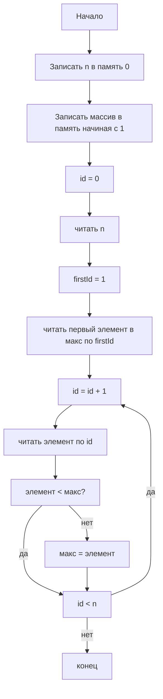
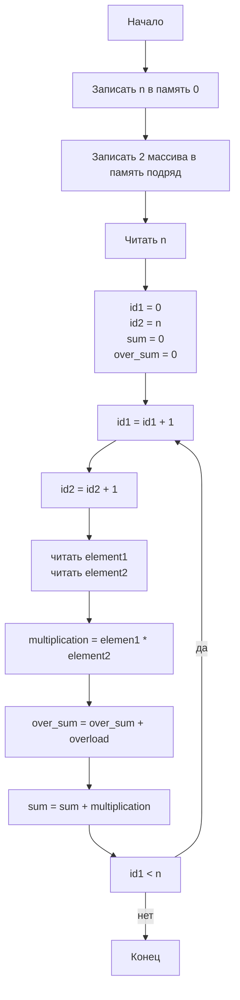

# Эмулятор процессора на Гарвардской архитектуре с трехадресными командами

## Набор команд
| код | команда | описание | литерал | dest | op1 | op2 |
|:--:|:--:|:--:|:--:|:--:|:--:|:--:|
| 0 | LTR | literal to memory | значение | регистр | - | - |
| 1 | RTM | register to memory | - | регистр с адресом | регистр | - |
| 2 | ADDL | add literal | значение | регистр | регистр | - |
| 3 | MTR | memory to register | - | регистр | регистр с адресом |  |
| 4 | JIL | jump if less | значение |  | регистр | регистр |
| 5 | RTR | register to register |  | регистр | регистр |  |
| 6 | ADD | add | - | регистр | регистр | регистр |
| 7 | MUL | multiply | - | регистр, младшие | регистр, op1 и переполнение | регистр, op2 |
| 8 | END | end of program |  |  |  |  |

## Задача 1. Поиск максимума в массиве
### Блок-схема

### Ассемблерный код
| #  | Команда             | Комментарий                              |
|----|---------------------|------------------------------------------|
| 1  | LTR 5, R0           | записать n                               |
| 2  | LTR 0, R1           | адрес нулевой ячейки                     |
| 3  | RTM [R1], R0        | записать n в память                      |
| 4  | ADDL 1, R1, R1      | перейти к следующей ячейке               |
| 5  | LTR 6, R0           | первый элемент массива                   |
| 6  | RTM [R1], R0        | записать в память                        |
| 7  | ADDL 1, R1, R1      | перейти к следующей ячейке               |
| 8  | LTR 2, R0           | второй элемент массива                   |
| 9  | RTM [R1], R0        | записать в память                        |
| 10 | ADDL 1, R1, R1      | перейти к следующей ячейке               |
| 11 | LTR 1, R0           | третий элемент массива                   |
| 12 | RTM [R1], R0        | записать в память                        |
| 13 | ADDL 1, R1, R1      | перейти к следующей ячейке               |
| 14 | LTR 8, R0           | четвертый элемент массива                |
| 15 | RTM [R1], R0        | записать в память                        |
| 16 | ADDL 1, R1, R1      | перейти к следующей ячейке               |
| 17 | LTR 3, R0           | пятый элемент массива                    |
| 18 | RTM [R1], R0        | записать в память                        |
|    |                     | программа                                |
| 19 | LTR 0, R0           | id = 0 в R0                              |
| 20 | MTR R1, [R0]        | считать n в R1                           |
| 21 | LTR 1, R2           | инициализация firstId = 1 в R2           |
| 22 | MTR R3, [R2]        | записать первый элемент в макс - R3      |
|    | m1:                 | первая метка                             |
| 23 | ADDL 1, R0, R0      | id = id + 1                              |
| 24 | MTR R2, [R0]        | читать элемент по id в R2                |
| 25 | JIL m2, R2, R3      | goto m2, если элемент < макс             |
| 26 | RTR R3, R2          | макс = элемент                           |
|    | m2:                 | вторая метка                             |
| 27 | JIL m1, R0, R1      | goto m1, если id < n                     |
| 28 | END                 | конец, ответ в R3                        |

## Задача 2. Свертка двух массивов, 6 элементов, целые числа без знака
### Блок-схема

### Ассемблерный код
| #  | Команда          | Комментарий                          |
|----|------------------|--------------------------------------|
|    |                  | запись данных в память               |
| 0  | LTR 6, R0        | записать n=6 в R0                    |
| 1  | LTR 0, R1        | адрес нулевой ячейки id=0 в R1       |
| 2  | RTM [R1], R0     | записать n в память                  |
|    |                  | Первый массив                        |
| 3  | ADDL 1, R1, R1   | id = id + 1                          |
| 4  | LTR 1, R0        | 1й элемент                           |
| 5  | RTM [R1], R0     | записать в память                    |
| 6  | ADDL 1, R1, R1   | id = id + 1                          |
| 7  | LTR 2, R0        | 2й элемент                           |
| 8  | RTM [R1], R0     | записать в память                    |
| 9  | ADDL 1, R1, R1   | id = id + 1                          |
| 10 | LTR 3, R0        | 3й элемент                           |
| 11 | RTM [R1], R0     | записать в память                    |
| 12 | ADDL 1, R1, R1   | id = id + 1                          |
| 13 | LTR 4, R0        | 4й элемент                           |
| 14 | RTM [R1], R0     | записать в память                    |
| 15 | ADDL 1, R1, R1   | id = id + 1                          |
| 16 | LTR 5, R0        | 5й элемент                           |
| 17 | RTM [R1], R0     | записать в память                    |
| 18 | ADDL 1, R1, R1   | id = id + 1                          |
| 19 | LTR 6, R0        | 6й элемент                           |
| 20 | RTM [R1], R0     | записать в память                    |
|    |                  | Второй массив                        |
| 21 | ADDL 1, R1, R1   | id = id + 1                          |
| 22 | LTR 1001, R0     | 1й элемент                           |
| 23 | RTM [R1], R0     | записать в память                    |
| 24 | ADDL 1, R1, R1   | id = id + 1                          |
| 25 | LTR 1002, R0     | 2й элемент                           |
| 26 | RTM [R1], R0     | записать в память                    |
| 27 | ADDL 1, R1, R1   | id = id + 1                          |
| 28 | LTR 1003, R0     | 3й элемент                           |
| 29 | RTM [R1], R0     | записать в память                    |
| 30 | ADDL 1, R1, R1   | id = id + 1                          |
| 31 | LTR 1004, R0     | 4й элемент                           |
| 32 | RTM [R1], R0     | записать в память                    |
| 33 | ADDL 1, R1, R1   | id = id + 1                          |
| 34 | LTR 1005, R0     | 5й элемент                           |
| 35 | RTM [R1], R0     | записать в память                    |
| 36 | ADDL 1, R1, R1   | id = id + 1                          |
| 37 | LTR 1006, R0     | 6й элемент                           |
| 38 | RTM [R1], R0     | записать в память                    |
|    |                  | программа                            |
| 39 | LTR 0, R0        | id=0 в R0                            |
| 40 | MTR R0, [R0]     | считать n в R0                       |
| 41 | LTR 0, R1        | id1 = 0 в R1                         |
| 42 | RTR R2, R0       | id2 = n в R2                         |
| 43 | LTR 0, R3        | sum = 0 в R3                         |
| 44 | LTR 0, R4        | over_sum = 0 в R4                    |
|    | m1:              | первая метка                         |
| 45 | ADDL 1, R1, R1   | id1 = id1 + 1                        |
| 46 | ADDL 1, R2, R2   | id2 = id2 + 1                        |
| 47 | MTR R5, [R1]     | считать element1 в R5                |
| 48 | MTR R6, [R2]     | считать element2 в R6                |
| 49 | MUL R6, R5, R6   | multiplication = element1*element2 в R6|
| 50 | JINO m2          | goto m2 если нет переполнения        |
| 51 | ADD R4, R4, R5   | over_sum = over_sum + overload       |
|    | m2:              | вторая метка                         |
| 52 | ADD R3, R3, R6   | sum = sum + multiplication           |
| 53 | JIL m1, R1, R0   | goto m1 если id1 < n                 |
| 54 | END              | конец. Ответ в R3 и R4 (переполнение)|