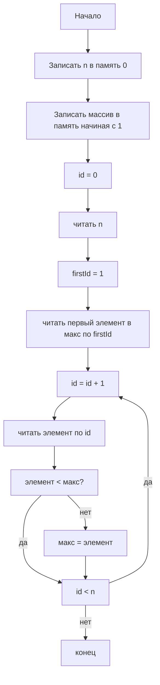

# Эмулятор процессора на Гарвардской архитектуре с трехадресными командами
## Задача 1. Поиск максимума в массиве

| код | команда | описание | литерал | dest | op1 | op2 |
|:--:|:--:|:--:|:--:|:--:|:--:|:--:|
| 0 | LTR | literal to memory | значение | регистр | - | - |
| 1 | RTM | register to memory | - | регистр с адресом | регистр | - |
| 2 | ADDL | add literal | значение | регистр | регистр | - |
| 3 | MTR | memory to register | - | регистр | регистр с адресом |  |
| 4 | JIL | jump if less | значение |  | регистр | регистр |
| 5 | RTR | register to register |  | регистр | регистр |  |
| 6 | END |  |  |  |  |  |

## Задача 2. Свертка двух массивов, 6 элементов, целые числа без знака
